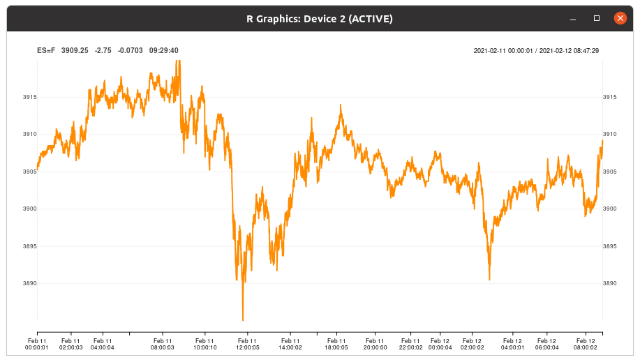

## Pub/Sub Example with 'Live' Intra-Daily Market Data

### What Is This?

This directory contains a pair of files to gather and display "live" (_i.e._
delayed by the usual amount as is common for non-subscribers to generally
expensive live market data) futures data.

### What Does It Look Like?

Here is a screenshot from a few months ago. The plotting logic and details have
not changed. Displayed are two days worth of price snapshots every ten seconds.

### Give Me More Details

One file uses package [quantmod](https://cloud.r-project.org/package=quantmod)
to gather the data. It collects the data points in [Redis](https://redis.io) to
build a history, but also publishes the on a channel by the name of the symbol.

The second file retrieves the recent history, and subscribes to the channel to
receive updates which it displays as it gets them.  Because it uses an R
graphics device to plot (also via package
[quantmod](https://cloud.r-project.org/package=quantmod)) it is easiest to
`source()` the file in an R session. (`Rscript` defaults to setting
`interactive` to FALSE; otherwise R can be used with `--interactive`, or `r`
from [littler](https://cloud.r-project.org/package=quantmod) can be used with
its `-i` switch).

The third file should be invoked weekly or daily from `crontab` and prunes the
history down to just the last months.  All three files could be generalized to
read more than one symbol, or host, or ... from config files.  For now, and for
simplicity, just the front ES contract is monitored.

### Going Further

The second set of files generalizes the approach to subscribe to a set of
symbols---where we use a set of symbols from CME Globex, an electronic trading
system with extended hours.
Data for each symbols is cached, and published, in the 'to-Redis' file.
The corresponding 'from-Redis' file consumes and plots the data, again using a
single process to cover multiple symbols and subscriptions.

### Acknowledgements

These files owes their basic structure to a [gist by Josh Ulrich](https://gist.github.com/joshuaulrich/ee11ef67b1461df399b84efd3c8f9f67#file-intraday-sp500-r)
which also contained the basic subscription loop (and which is also the basis of
this [extended and documented version in package
dang](https://github.com/eddelbuettel/dang/blob/master/R/intradayMarketMonitor.R). This
was then generalized to use a symbol such as `ES=F` (for the front month SP500
futures contract) for which no history is available by both caching in [Redis](https://redis.io)
and using pub/sub to distribute.  The `rredis` package (installable from the
[ghrr drat](https://ghrr.github.io/drat) repo) was used for the initial
pub/sub approach.  Bryan W. Lewis then ported and adapted the pub/sub model to
this RcppRedis package.

### Authors

Dirk Eddelbuettel, Joshua Ulrich, Bryan W. Lewis

### License

GPL (>= 2)
